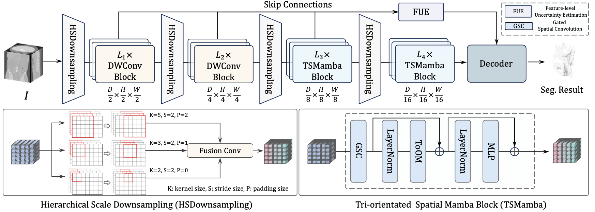

# SegMamba-V2

**SegMamba-V2: Long-range Sequential Modeling with Mamba for General 3D Medical Image Segmentation**

This repository is still being updated.



---

## Datasets

### BraTS 2023
- Source: [BraTS 2023 Paper](https://arxiv.org/abs/2305.17033)
- Download Links:
  - [Baidu Disk](https://pan.baidu.com/s/1C0FUHdDtWNaYWLtDDP9TnA?pwd=ty22) (Access Code: `ty22`)
  - [OneDrive](https://hkustgz-my.sharepoint.com/:f:/g/personal/zxing565_connect_hkust-gz_edu_cn/EqqaINbHRxREuIj0XGicY2EBv8hjwEFKgFOhF_Ub0mvENw?e=yTpE9B)

### AIIB 2023
- Source: [AIIB Challenge](https://codalab.lisn.upsaclay.fr/competitions/13238)

### AbdomenAtlas
- Source: [GitHub - AbdomenAtlas](https://github.com/MrGiovanni/AbdomenAtlas)

### Colorectal
- To obtain the data, please contact the corresponding author: [gaof57@mail.sysu.edu.cn](mailto:gaof57@mail.sysu.edu.cn)

## Pre-trained weights

We provide the pre-trained weights, which can be accessed in [https://hkustgz-my.sharepoint.com/my?id=%2Fpersonal%2Fzxing565%5Fconnect%5Fhkust%2Dgz%5Fedu%5Fcn%2FDocuments%2Fsegmambav2&ga=1](https://hkustgz-my.sharepoint.com/my?id=%2Fpersonal%2Fzxing565%5Fconnect%5Fhkust%2Dgz%5Fedu%5Fcn%2FDocuments%2Fsegmambav2&ga=1)


## Code Structure

We currently support training pipelines for **BraTS2023** and **Colorectal** datasets. Each dataset folder (e.g., `brats23`, `colorectal`) includes:

1. Data preprocessing  
2. Model training  
3. Inference  
4. Metrics computation  

---

## Preprocessing

Example preprocessing code for Colorectal dataset:

```python
from light_training.preprocessing.preprocessors.preprocessor_coloretal import DefaultPreprocessor 
import json
import os

base_dir = "/data/xingzhaohu/colorectal/data/raw_data/random2500"
image_dir = "Image"
label_dir = "ROI"

def process_train():
    preprocessor = DefaultPreprocessor(base_dir=base_dir, image_dir=image_dir, label_dir=label_dir)
    out_spacing = [3.75, 0.79296899, 0.79296899]
    output_dir = "./data/fullres/train/"

    with open("./data_analysis_result.txt", "r") as f:
        stats = json.load(f)

    preprocessor.run(
        output_spacing=out_spacing, 
        output_dir=output_dir,
        all_labels=[1],
        foreground_intensity_properties_per_channel=stats["intensity_statistics_per_channel"]
    )

def plan():
    preprocessor = DefaultPreprocessor(base_dir=base_dir, image_dir=image_dir, label_dir=label_dir)
    preprocessor.run_plan()

if __name__ == "__main__":
    plan()
    # process_train()
```

**Usage**:  

\> First, we need to run the `plan()` function, which generates important info such as `out_spacing` and the `data_analysis_result.txt`.  

\> Then we use these parameters in `process_train()` to perform actual preprocessing.

---

## Training

Set up your training configuration:

```python
data_dir = "./data/fullres/train"  # Directory after preprocessing

logdir = "./logs/segmambav2"  # Log directory
model_save_path = os.path.join(logdir, "model")

env = "DDP"  # DDP = Distributed Data Parallel (multi-GPU training)
# env = "pytorch"  # Uncomment this to use a single GPU

max_epoch = 1000
batch_size = 2
val_every = 2  # Validate once every two epochs
num_gpus = 4 # we use four gpus for training
device = "cuda:0"
patch_size = [128, 128, 128]  # Sample size per 3D case
augmentation = True  # Whether to use data augmentation
```

**Run training**:

```bash
python 3_train.py
```

---

## Inference

After training, run inference on the test set. Key code snippet:

```python
def define_model_segmambav2(self):
    from models_segmamba.segmambav2 import SegMamba
    model = SegMamba(in_channels=4, out_channels=4)

    model_path = "./final_model_0.8388.pt"
    model.load_state_dict(self.filte_state_dict(torch.load(model_path, map_location="cpu")))
    model.eval()

    window_infer = SlidingWindowInferer(
        roi_size=patch_size,
        sw_batch_size=2,
        overlap=0.5,
        progress=True,
        mode="gaussian"
    )

    predictor = Predictor(window_infer=window_infer, mirror_axes=[0, 1, 2])
    save_path = "./prediction_results/segmambav2"
    os.makedirs(save_path, exist_ok=True)

    return model, predictor, save_path
```

**Run inference**:

```bash
python 4_predict.py
```

---

## Evaluation

Once predictions are saved to `./prediction_results/segmambav2`, compute evaluation metrics:

```bash
python 5_compute_metrics --pred=segmambav2
```

---

